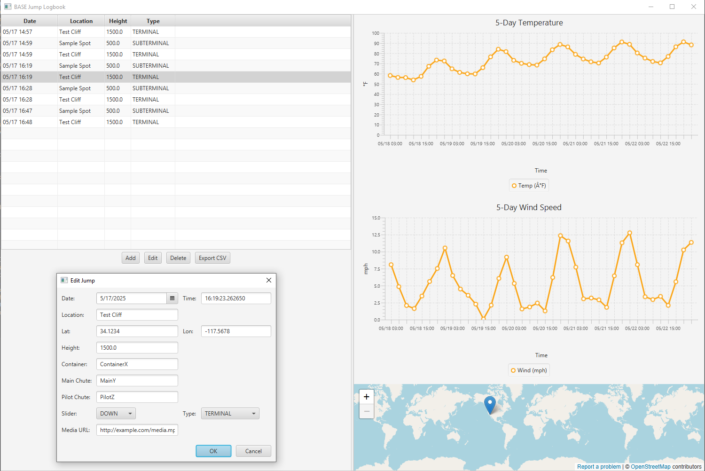

[](https://github.com/masonakcamara/base-jump-logbook/releases)

# BASE Jump Logbook

JavaFX desktop application for logging BASE jumps and viewing integrated 5-day weather forecasts.

## Table of Contents

1. [Features](#features)
2. [Tech Stack](#tech-stack)
3. [Prerequisites](#prerequisites)
4. [Installation](#installation)
5. [Usage](#usage)  
   - [Run from Source](#run-from-source)  
6. [Building a Fat JAR](#building-a-fat-jar)
7. [Environment Variable Option](#environment-variable-option)
8. [Contributing](#contributing)
9. [License](#license)

## Features

- Log jumps with date, time, location, coordinates, height, gear, jump type and media link
- View 5-day temperature and wind speed charts for each jump location
- Embedded map view via OpenStreetMap
- Full Create, Read, Update, Delete (CRUD) interface
- Export jump log to CSV
- Packaged as a single runnable JAR

## Tech Stack

- Java 17  
- JavaFX (Controls, FXML, WebView)  
- Hibernate ORM with H2 embedded database  
- OpenWeatherMap API for weather forecasts  
- Maven build system  
- JUnit 5 and Mockito for testing

## Prerequisites

- Java Development Kit 17 or higher  
- Maven 3.6+  

## Installation

1. Clone the repository  
   ```bash
   git clone https://github.com/masonakcamara/base-jump-logbook.git
   cd base-jump-logbook
   ```  
2. Copy the API key template and insert your OpenWeatherMap key  
   ```bash
   cp src/main/resources/weather.properties.template src/main/resources/weather.properties
   # edit src/main/resources/weather.properties and set api.key=YOUR_API_KEY
   ```

## Usage

### Run from Source

```bash
mvn clean javafx:run
```

## Building a Fat JAR

From the project root run:

```bash
mvn clean package
```

The shaded JAR will be in `target/` named `base-jump-logbook-1.0-SNAPSHOT.jar`.

## Environment Variable Option

Set the OpenWeatherMap key via environment variable instead of a properties file:

```bash
export OPENWEATHER_API_KEY=your_key_here
java --module-path $PATH_TO_FX --add-modules javafx.controls,javafx.fxml,javafx.web -jar base-jump-logbook-1.0-SNAPSHOT.jar
```

## Contributing

Contributions are welcome. Fork the repo, make changes, and open a pull request.

## License

This project is licensed under the MIT License. See [LICENSE](LICENSE) for details.

## Demo


